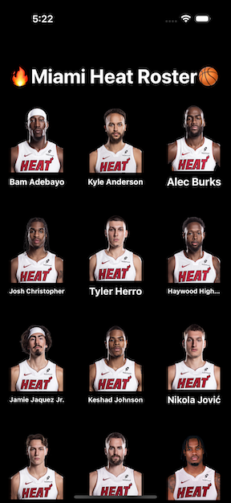
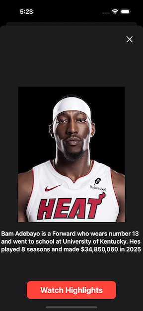

# Miami Heat Roster

A simple SwiftUI app that showcases the current Miami Heat roster with 
player images and detailed profiles. Built to demonstrate SwiftUI fundamentals
like navigation, list views, and data-driven UI

## 📸 Screenshots

 

## 🚀 Features

- Display a grid view of players with names, titles, and photos
- Shows player details and a short recap of their career using string interpolation
- Pie chart to display salary distribution among all players
- Modular, clean code using MVVC

## 🛠️ Technologies Used

- SwiftUI
- Xcode

## 📦 Installation

1. Clone the repo:
   ```bash
   git clone https://github.com/your-username/Miami-heat-roster.git

